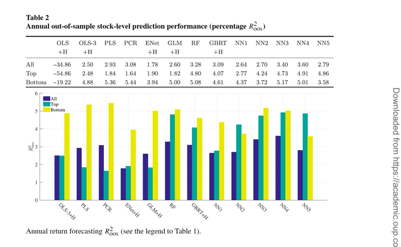
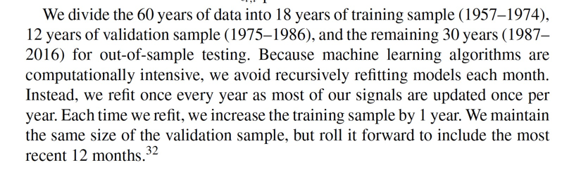
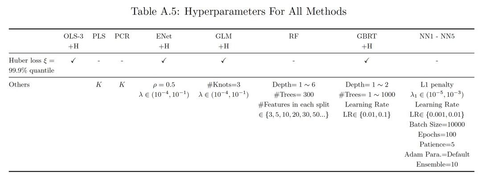
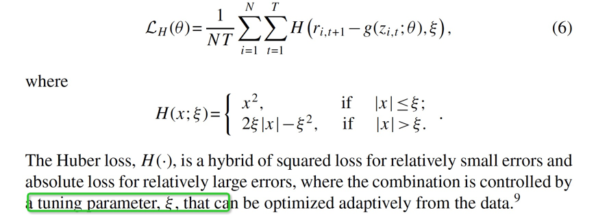

- autoencoder paper

D. Kyle Miller replicate a baseline model and publis his code at [github repo](https://github.com/dkyol/Asset-Pricing-Model)

[medium article](https://medium.com/@dkylemiller/pytorch-implementation-of-autoencoder-that-dominates-competing-asset-pricing-models-including-cee701818225#id_token=eyJhbGciOiJSUzI1NiIsImtpZCI6ImZkYjQwZTJmOTM1M2M1OGFkZDY0OGI2MzYzNGU1YmJmNjNlNGY1MDIiLCJ0eXAiOiJKV1QifQ.eyJpc3MiOiJodHRwczovL2FjY291bnRzLmdvb2dsZS5jb20iLCJuYmYiOjE2MTM2MzU2NDUsImF1ZCI6IjIxNjI5NjAzNTgzNC1rMWs2cWUwNjBzMnRwMmEyamFtNGxqZGNtczAwc3R0Zy5hcHBzLmdvb2dsZXVzZXJjb250ZW50LmNvbSIsInN1YiI6IjEwNTk1MDcxNTkzMDk2MTg1MzMxNyIsImVtYWlsIjoiemhvdWppYW5jdXBsQGdtYWlsLmNvbSIsImVtYWlsX3ZlcmlmaWVkIjp0cnVlLCJhenAiOiIyMTYyOTYwMzU4MzQtazFrNnFlMDYwczJ0cDJhMmphbTRsamRjbXMwMHN0dGcuYXBwcy5nb29nbGV1c2VyY29udGVudC5jb20iLCJuYW1lIjoiRGF2aWQgRmlzaCIsInBpY3R1cmUiOiJodHRwczovL2xoMy5nb29nbGV1c2VyY29udGVudC5jb20vYS0vQU9oMTRHajRKXzBiOVpxeDRsMkNHWjBrUnByT2xKNVpmSDhuSmhQb1E2M1g9czk2LWMiLCJnaXZlbl9uYW1lIjoiRGF2aWQiLCJmYW1pbHlfbmFtZSI6IkZpc2giLCJpYXQiOjE2MTM2MzU5NDUsImV4cCI6MTYxMzYzOTU0NSwianRpIjoiODhlZGFlNDYyOWEyYmU5Y2ExMWViOGYyMDAyMjMyMTVlNzQ0NTQyMyJ9.RIAtMnx1Ji3J5jx3r_-Ww3-HgncUHWhEkDqIFqrmSH5rl5mRsjD5DmxTecx3f3XHRaRpIV-S-li7urlIpAjc1FYPxMtHz5pDOF_7iZS5SZ6WCvgE6ENtph5Z0LOa8td0Wr0Nc0p3sVnefMB_N81nw0fieeO189GVk9Mh5EsIXqaMn_46xGITH9iXGizOvquTDCjrx3mDGhQcrSPGItdqDQXVYixs34TdEKKdt2132cpG6u18Qd6quQ5ha39hnNXHxqVijgNCnwr1krUKPGcit5rkTKQasCBUQW2D22L51ppceRCpKKCvF9breF8PfeKCS2_7Hjlybt2NvBDjlOnbhg)

- machine-learning paper
  
    - to plot
      
      
    - Xiu's validation/testing time
      
        
    refit every year, maintain same size of validation sample, test for the subsequent year
  
    - huber loss
      99.9% quantile
      
    - OLS-H
      
